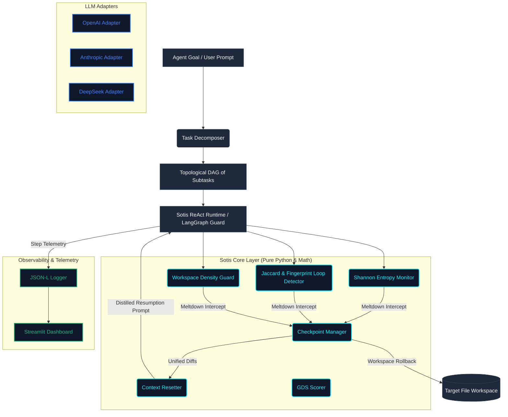
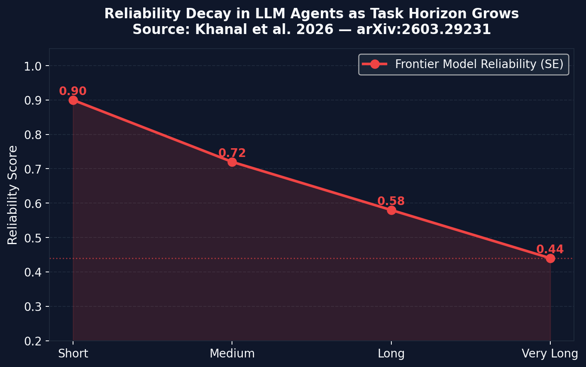
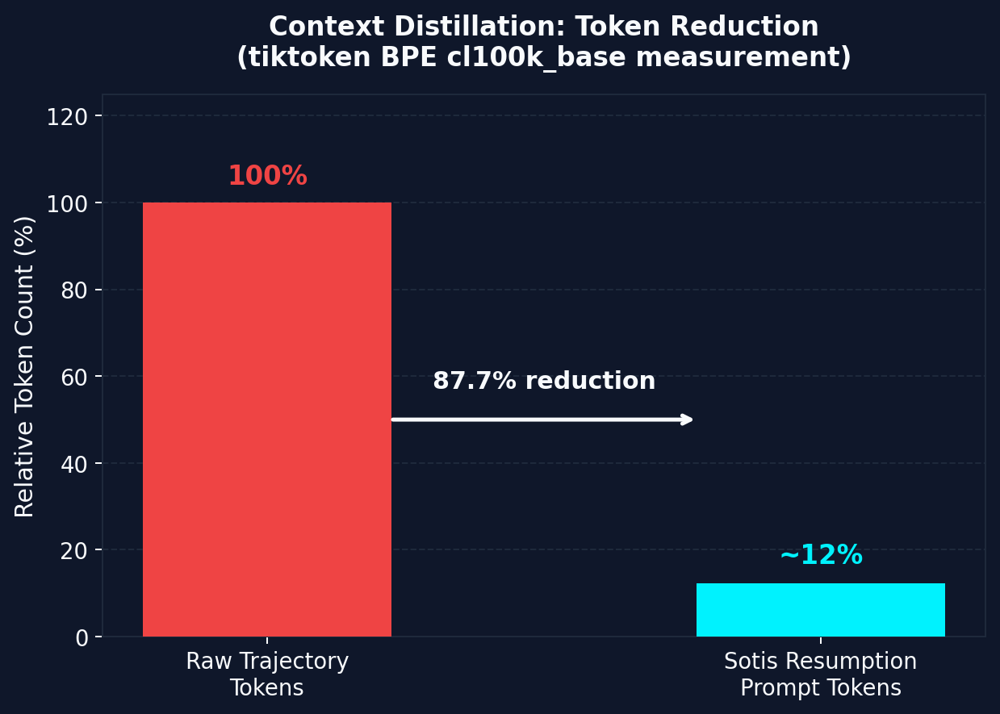
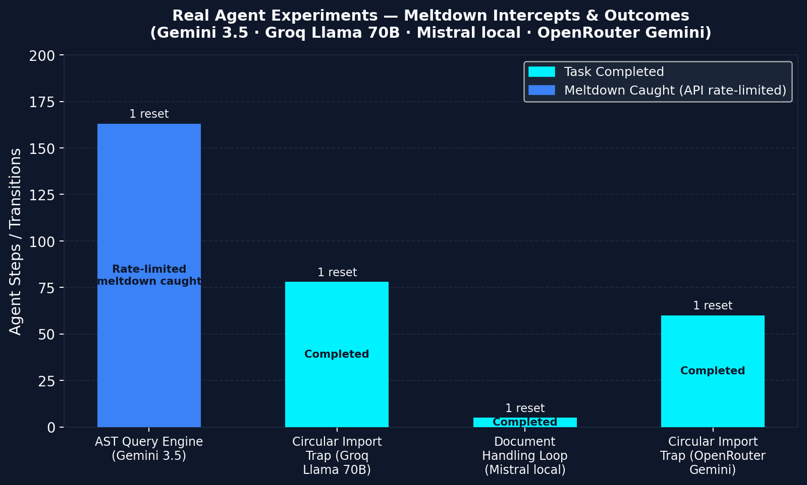

# Sotis

**Sotis watches your LLM agent and catches it before it spirals.**

[](https://pypi.org/project/sotis/)
[]()
[]()
[](ARCHITECTURE.md)

```bash
pip install sotis
```

Long-running agents fail in predictable ways — they loop on the same tool calls, flood their context with error traces, and spiral until the task collapses. Sotis detects these failure patterns in real time and transparently resets execution before they take hold.

*Based on ["Beyond pass@1: A Reliability Science Framework for Long-Horizon LLM Agents"](https://arxiv.org/abs/2603.29231) (arXiv:2603.29231, April 2026)*

---

## Architecture



> Full architecture details, module descriptions, and design decisions: [ARCHITECTURE.md](ARCHITECTURE.md)

---

## The Problem

Current AI agents fail predictably under long-horizon execution. As tasks grow longer, agents accumulate error and drift into terminal failure modes:

- **Infinite Loops** — repeating the same tool calls with identical arguments
- **Semantic Spirals** — rephrasing failed queries hoping for different outcomes
- **Context Poisoning** — flooding history with massive error traces and linter warnings
- **Edit Storms** — making rapid, uncoordinated file edits without shifting outputs

Frontier models do not fail because they are simple. They fail because long-horizon execution decays their reliability envelope until strategy collapse occurs. Sotis acts as an active runtime stabilizer — monitoring execution, detecting behavioral meltdowns, and transparently resetting context to restore forward progress.

---

## Usage

```python
from sotis import SotisGuard

guard = SotisGuard()

for step in range(max_steps):
    action = agent.decide()
    result = tools.execute(action)

    meltdown = guard.watch(action.name, action.args, result.summary)

    if meltdown:
        guard.reset()  # rolls back files, distills context, resumes cleanly
```

### What it looks like in practice

```
[Step 22] write_file -> {"path": "src/main.py", "content": "import math"} | SUCCESS
[Step 23] run_tests  -> {"cmd": "pytest"} | FAIL (ImportError)
[Step 24] write_file -> {"path": "src/main.py", "content": "import math"} | SUCCESS
[Step 25] run_tests  -> {"cmd": "pytest"} | FAIL (ImportError)

[WARNING]   Anomaly detected: Workspace edit storm and exact argument loops
[INTERCEPT] Sotis Meltdown Interception Triggered!
[RECOVER]   Restored workspace files to stable baseline (step 22 diff)
[RECOVER]   Distilled session context history (78% token savings)
[RESUME]    Injecting resumption briefing into agent context...

[Step 26] grep_search -> {"query": "math"} | Execution resumed cleanly
```

---

## Claude Code (MCP)

Sotis ships an MCP server so any MCP-capable agent — Claude Code, Claude Desktop —
can report its tool calls and get live meltdown verdicts, while streaming the same
telemetry to the dashboard.

**1. Install with the MCP extra:**

```bash
pip install sotis[mcp]
```

**2. Register the server** in your project's `.mcp.json` (or Claude Desktop config):

```json
{
  "mcpServers": {
    "sotis": { "command": "sotis", "args": ["mcp"] }
  }
}
```

**3. Tell the agent to use it** — add this to your `CLAUDE.md`:

```
At the start of a task, call sotis_start_session with the goal.
After every tool call, call sotis_watch(tool_name, tool_args, result_summary).
If Sotis reports a meltdown, stop, re-read the task, and change approach.
```

**4. Watch it live:** run `sotis dashboard`, pick the `mcp` session, and toggle
Live Mode.

The server exposes four tools:

| Tool | Purpose |
|------|---------|
| `sotis_start_session(task_goal)` | Begin a monitoring session |
| `sotis_watch(tool_name, tool_args, result_summary)` | Report a tool call, get a meltdown verdict |
| `sotis_status()` | Current status, steps, resets, entropy |
| `sotis_reset()` | Manually clear the rolling window after a deliberate strategy change |

---

## Tuning

The default entropy threshold (`1.5 bits`) is calibrated for agents that use 1-2 tools in tight loops. If your agent legitimately uses 3+ different tools in a short window, the default will fire false positives — `log2(3) = 1.585 > 1.5`.

Raise the threshold for multi-tool agents:

```python
from sotis import SotisGuard
from sotis.core.entropy import EntropyConfig

guard = SotisGuard(entropy_config=EntropyConfig(hard_threshold=2.7))
```

| Threshold | Behavior |
|---|---|
| `1.5` (default) | Catches tight loops fast. Will false-positive on diverse tool usage. |
| `2.0` | Good balance for agents using 3-4 tools regularly. |
| `2.7` | Permissive — only fires on genuine chaotic switching across 6+ tools. |

This was validated in the [detection gauntlet](ExperimentLog/real_world_validation/test5_gauntlet_20260529_212356.txt): default threshold fired a false positive on healthy diverse work (Scenario E), raising to 2.7 eliminated it while preserving 100% true positive detection.

---

## Active Stabilization, Not Passive Tracing

Tools like LangSmith, Langfuse, and Helicone log what happened after your agent already spent $20 looping in production.

Sotis intervenes *during* execution. It intercepts spiraling tool calls, rolls back uncommitted file edits, distills conversation history, and redirects the model's reasoning loop — before the damage accumulates.

---

## Capabilities

| Capability | Description |
|---|---|
| **Meltdown Detection** | Sliding-window Shannon entropy (w=5, H=1.5) + exact loop detection |
| **Workspace Density Guard** | Detects infinite same-file edit cycles |
| **Transparent Reset** | Git-diff checkpointing + distilled context rebuild (≥60% token savings) |
| **Graceful Degradation** | GDS scoring preserves partial progress across resets |
| **LangGraph Integration** | Native guard node — intercepts state, rolls back files |
| **Document Processing** | PDF, XLSX, Word, CSV support + Jaccard semantic loop detection |
| **LLM Support** | OpenAI, Anthropic, DeepSeek, Google Gemini |
| **Observability** | Streamlit dashboard + structured JSON session logs |

---

## The Science

Sotis operationalizes the formal reliability framework from *["Beyond pass@1: A Reliability Science Framework for Long-Horizon LLM Agents"](https://arxiv.org/abs/2603.29231)* (arXiv:2603.29231, April 2026).

Four key findings from the paper that Sotis directly addresses:

**Meltdown Onset Point (MOP)** — the paper quantifies the transition from coherent planning to chaotic looping via sliding-window Shannon entropy. Sotis implements this as a live runtime monitor with a calibrated threshold of H=1.5 bits over a 5-step window.

**Super-linear reliability decay** — agent success rates decay faster than mathematically expected because errors are positively correlated across steps. A confused agent stays confused. Sotis acts as a circuit breaker that resets the error correlation coefficient by starting fresh from a verified checkpoint.

**Episodic memory failures** — the paper demonstrates that naive memory scaffolds universally degrade long-horizon performance by accumulating context overhead. Sotis uses controlled checkpointed resets instead of continuous memory accumulation.

**Graceful Degradation Score (GDS)** — rather than binary pass/fail, Sotis scores partial task completion using weighted subtask graphs, preserving measured progress across reset boundaries.

---

## Performance

| Metric | Result |
|---|---|
| Entropy + loop detection latency | < 0.2ms per step |
| Context distillation token reduction | ~87% (BPE cl100k_base) |
| Test suite | 127 tests, 88% coverage |
| Live recovery | Verified on circular import and AST recursive loop traps |
| Live LLM validation (llama-3.1-8b on Groq) | Raw agent: 1/4 requirements met. Sotis agent: 3/4 requirements met. |
| Detection accuracy (6-scenario gauntlet) | 100% true positive rate, 0% false negatives |
| Total API cost for full validation suite | < $0.01 (Groq free tier) |

Full empirical ledger: [`performance_metrics.txt`](https://github.com/Shaurya-34/Sotis/blob/main/performance_metrics.txt)

Real-world validation logs: [`ExperimentLog/real_world_validation/`](ExperimentLog/real_world_validation/)

---

## Benchmarks

**Reliability decay in frontier LLM agents as task horizon grows** *(Khanal et al. 2026 — arXiv:2603.29231)*



**Context distillation: token reduction after meltdown reset** *(measured with tiktoken BPE cl100k_base)*



**Real agent experiments — meltdown intercepts and outcomes** *(Gemini 3.5 · Groq Llama 70B · Mistral local · OpenRouter Gemini)*



---

## Project Structure

```
sotis/
  core/     # Entropy, loop detection, checkpoint, decomposition, GDS
  lib/      # ReAct runtime, LangGraph integration, LLM adapters
  obs/      # Streamlit dashboard + structured JSON logger
  bench/    # Benchmark harness and task generators
```

---

## License

MIT
